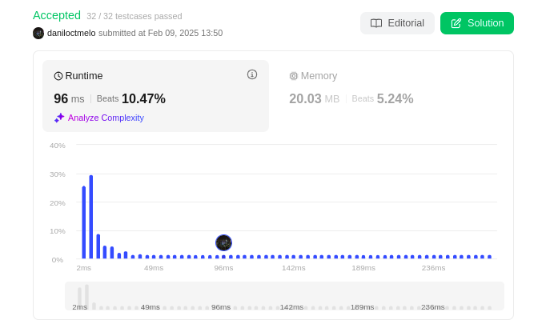
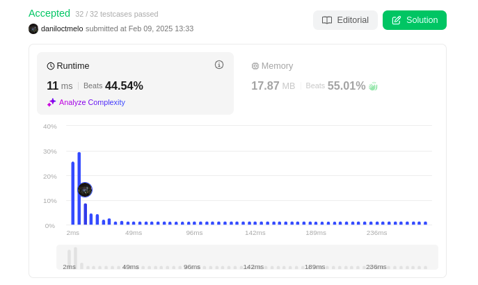

# NomedoProjeto

**Número da Lista**: 5 
**Conteúdo da Disciplina**: Programação Dinâmica 

## Alunos
|Matrícula | Aluno |
| -- | -- |
| 22/1031149  |  Danilo César Tertuliano Melo |
| 22/1008267  |  Lucas Gama de Araujo Bottino |

## Sobre 
Descreva os objetivos do seu projeto e como ele funciona. 

## Screenshots

### [Questão: 773. Sliding Puzzle (Difícil)](https://leetcode.com/problems/sliding-puzzle/description/)

A questão do "Sliding Puzzle" no LeetCode envolve encontrar a sequência mínima de movimentos necessários para transformar um tabuleiro de 2x3 com peças embaralhadas em um estado objetivo, onde as peças estão organizadas na ordem crescente com um espaço vazio no final.

Solução por Programação Dinâmica 

Solução por DFS

## Instalação 
**Linguagem**: python 
**Framework**: (caso exista) 
Descreva os pré-requisitos para rodar o seu projeto e os comandos necessários.

## Uso 
Explique como usar seu projeto caso haja algum passo a passo após o comando de execução.

## Outros 
Quaisquer outras informações sobre seu projeto podem ser descritas abaixo.