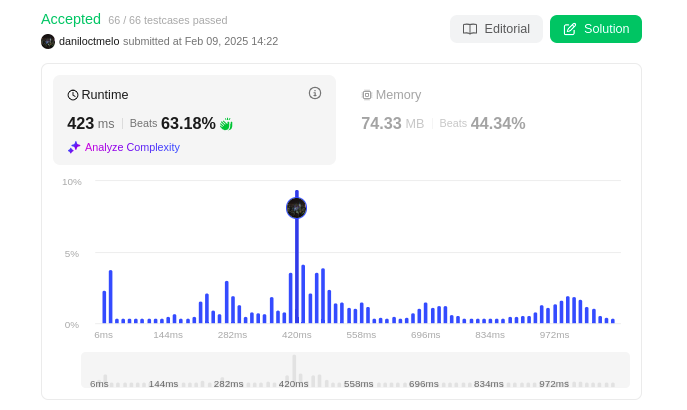
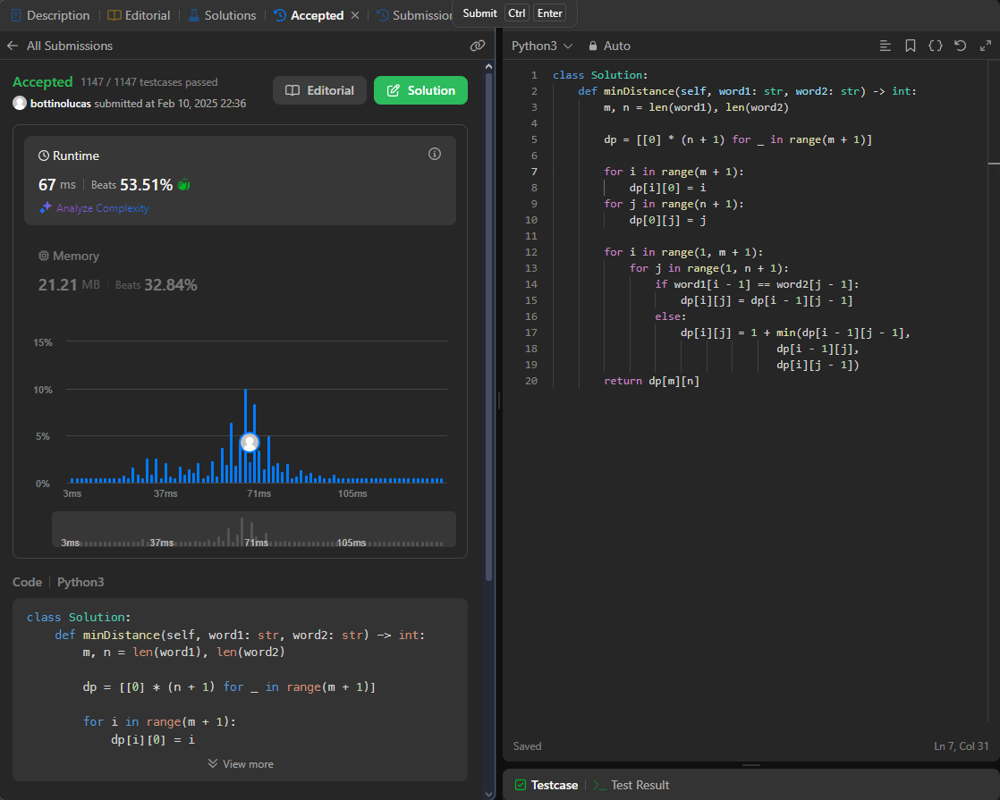
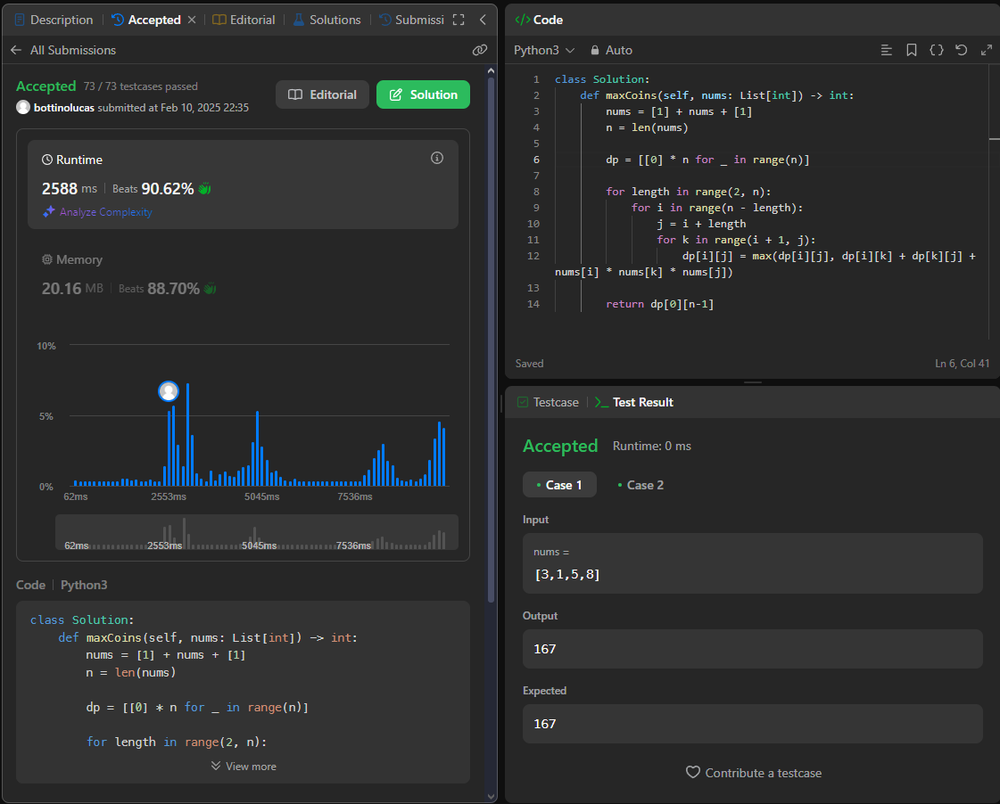

# Problemas Programação Dinâmica

**Número da Lista**: 5 
**Conteúdo da Disciplina**: Programação Dinâmica 

## Alunos

| Matrícula  | Aluno                        |
| ---------- | ---------------------------- |
| 22/1031149 | Danilo César Tertuliano Melo |
| 22/1008267 | Lucas Gama de Araujo Bottino |

## Sobre

Para esse trabalho escolhemos realizar questões do leetcode.

## Screenshots

### [Questão: 773. Sliding Puzzle (Difícil)](https://leetcode.com/problems/sliding-puzzle/description/)

A questão do "Sliding Puzzle" no LeetCode envolve encontrar a sequência mínima de movimentos necessários para transformar um tabuleiro de 2x3 com peças embaralhadas em um estado objetivo, onde as peças estão organizadas na ordem crescente com um espaço vazio no final.

Solução por Programação Dinâmica

Solução por DFS

### [Questão: 115. Distinct Subsequences (Difícil)](https://leetcode.com/problems/distinct-subsequences/description/)

Dada duas strings `s` e `t`, a tarefa é retornar o número de subsequências distintas de `s` que são iguais a `t`. A solução deve contar quantas formas diferentes é possível formar `t` a partir de `s` respeitando a ordem dos caracteres. Exemplo: Para `s = "rabbbit"` e `t = "rabbit"`, a resposta é 3.

Solução por Programação Dinâmica

### [Questão 72. Edit Distance (Média)](https://leetcode.com/problems/edit-distance/description/)

### [Questão 312. Burst Balloons](https://leetcode.com/problems/burst-balloons/description/?en)

## Instalação

**Linguagem**: python 

## Vídeo

Vídeo da [Questão 773 e 115](https://youtu.be/hPcsASDYTQA)
Vídeo da [Questão 72 e 312](https://youtu.be/8shD6dlKaRE)
